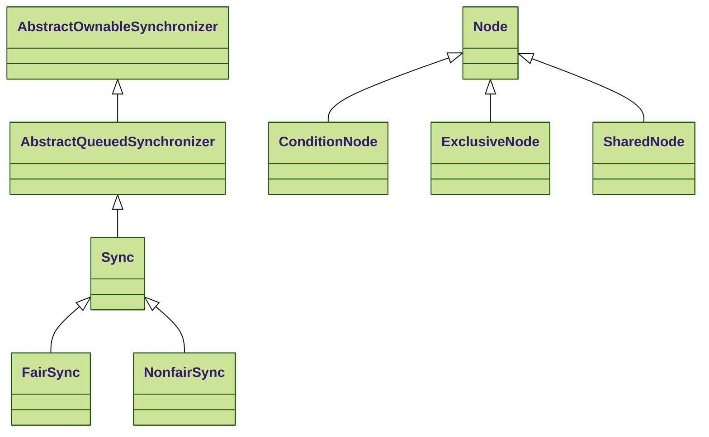
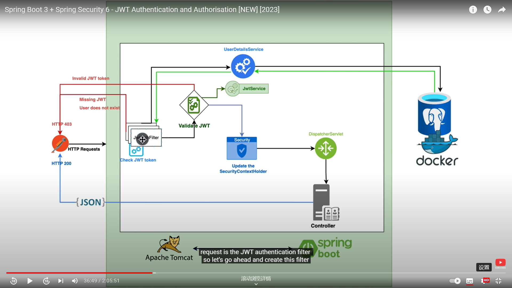

<!-- TOC -->
* [spring-all](#spring-all)
  * [Getting started](#getting-started)
  * [Add your files](#add-your-files)
  * [Collaborate with your team](#collaborate-with-your-team)
  * [SSL](#ssl)
    * [generate key](#generate-key)
  * [Gradle](#gradle)
    * [proxy:](#proxy)
  * [About AQS](#about-aqs)
  * [About Observation](#about-observation)
    * [spring micrometer grafana](#spring-micrometer-grafana)
    * [Tracing](#tracing)
  * [Java Optimize](#java-optimize-)
  * [PDF generator](#pdf-generator)
  * [AOP](#aop)
  * [Hibernate](#hibernate)
  * [Security](#security)
    * [Authenticate with JWT](#authenticate-with-jwt)
<!-- TOC -->

# spring-all

## Getting started

To make it easy for you to get started with GitLab
here's a list of recommended next steps.

## Add your files

- [ ] [Create](https://docs.gitlab.com/ee/user/project/repository/web_editor.html#create-a-file) or [upload](https://docs.gitlab.com/ee/user/project/repository/web_editor.html#upload-a-file) files
- [ ] [Add files using the command line](https://docs.gitlab.com/ee/gitlab-basics/add-file.html#add-a-file-using-the-command-line) or push an existing Git repository with the following command:

## Collaborate with your team

- [ ] [Invite team members and collaborators](https://docs.gitlab.com/ee/user/project/members/)
- [ ] [Create a new merge request](https://docs.gitlab.com/ee/user/project/merge_requests/creating_merge_requests.html)
- [ ] [Automatically close issues from merge requests](https://docs.gitlab.com/ee/user/project/issues/managing_issues.html#closing-issues-automatically)
- [ ] [Enable merge request approvals](https://docs.gitlab.com/ee/user/project/merge_requests/approvals/)
- [ ] [Set auto-merge](https://docs.gitlab.com/ee/user/project/merge_requests/merge_when_pipeline_succeeds.html)

***********************************************
## SSL
server and client setup: check application.yml & CallerMainApp/EchoMainApp

trust/key store

for mTLS
the server **must** contain a trust store of client certificate

otherwise the client connection will have bad_certificate error.

### generate key


```shell
# Generate private key and paired certificate:
# from https://www.youtube.com/watch?v=VH4gXcvkmOY

openssl genrsa -aes256 -out ca-key.pem 4096  # generate private key.
# The mey is encrypted with aes with pass phrase. 
# So the prompt will ask for a phrase input
# Keep pass phrase in mind.
# The key will be output to ca-key.pem

openssl req -new -x509 -sha256 -days 365 -key ca-key.pem -out ca.pem
openssl req -new -x509 -sha256 -days 365 -key ca-key.pem -out ca.pem \
  -config ./req.conf -extensions v3_req 
# Will generate x509 certificate.
# The prompt will then ask you the phrase which you used to encrypt the private key 
# in ca-key.pem.
# Here you can put your subject
# Organization name
# Common name... 1


cat ca.pem 
# This will show you the certificate you just created in pem file
# -----BEGIN CERTIFICATION-----
# This is the content of the cert file 
# -----END CERTIFICATION----- 
openssl x509 -in ca.pem -text -noout
# This will show you in human readable format

######################################################################################################

# ADD MORE CERTIFICATE AS CERTIFICATE CHAIN

openssl genrsa -out cert-key.pem 4096 
# this time the key file is not encrypted.

openssl req -new -sha256 -sub "/CN=youDomain" -key cert-key.pem -out cert.csr
openssl req -new -sha256                      -key cert-key.pem -out cert.csr \
  -config ./req2.conf -extensions v3_req 
# again create certificate
# Here you can put your subject
# Organization name
# Common name... 2
openssl req -in ./cert.csr -text -noout
# Check csr file

echo "subjectAltName=DNS:your.dns.record,DNS:req1.com,DNS:localhost,IP:10.10.10.1" > extfile.cnf
# Alias name
# this step it is not the config file in step 1 
# optional used.
# see details below
openssl x509 -req -sha256 -days 365 -in ./cert.csr -CA ./ca.pem -CAkey ./ca-key.pem -out ./cert.pem \
  -extfile req2.conf -CAcreateserial -extensions v3_req2 -clrext
# -extensions v3_req2
#     - -clrext Do not take over any extensions from the source certificate or request 
#             Used when extension name also exists in CA's config
#     - or give another extension name in conf file. req_extensions=v3_req2 then can eliminate clrest
#     - or echo "subjectAltName=DNS:your.dns.record,DNS:req1.com,DNS:localhost,IP:10.10.10.1" > extfile.cnf
#          then use the extfile.cnf without -clrext
# -CAcreateserial will create a serial number which is used when you create multiple certificate

# Still the prompt will ask for the pass phrase for ca-key.pem

cat cert.pem > fullchain.pem
cat ca.pem >> fullchain.pem
# We can combine 2 files together

# now the final private key file:
cat cert-key.pem  
# ----- BEGIN RSA PRIVATE KEY -----
# RSA 256 string....
# ----- END RSA PRIVATE KEY -----

# the final cert file:
cat fullchain.pem
# -----BEGIN CERTIFICATION-----
# SHA256 string 1 
# -----END CERTIFICATION----- 
# -----BEGIN CERTIFICATION-----
# SHA256 string 2
# -----END CERTIFICATION----- 

# Then keytool:
cat ./fullchain.pem cert-key.pem > combined.pem
openssl pkcs12 -export -inkey ./cert-key.pem -in ./combined.pem -name server-key -out ./keystore.p12
# key store created

keytool -J-Duser.language=en -import -alias server-key -file ./fullchain.pem -keystore ./certstore.p12
# trust store created

keytool -J-Duser.language=en -import -alias ca-key -file ./ca.pem -keystore ./ca_certstore.p12
# create p12 trust store for CA

keytool -importkeystore -srckeystore ./ca_certstore.p12 -srcstoretype pkcs12 -destkeystore ./certstore.p12 -deststoretype pkcs12
# Merge CA and cert store
# Must contains CA cert otherwise client will not be able to find certificate path. 

keytool -list -v -keystore ./keystore.p12 
keytool -list -v -keystore ./certstore.p12 
# Check


# Something more
openssl ecparam -list_curves
# This cmd is used to see ellipse curve 
# (don't know how ellipse used for encryption)

```
**No need to provide a trust store if server doesn't accept client ssl authentication.**

to enable debug ssl:

-Djavax.net.debug=all


```shell
# MORE ABOUT I USE CONF FILE TO ADD MORE DNS NAMES

rm ./$order/*

openssl version

openssl genrsa -out ./$order/diagclientCA.key 2048

openssl req -x509 -new -key ./$order/diagclientCA.key \
  -config ./$order.conf -extensions v3_req \
  -sha256 -days 1024 -out ./$order/diagclientCA.pem

openssl pkcs12 -export -name client-cert-$order \
  -in ./$order/diagclientCA.pem -inkey ./$order/diagclientCA.key \
  -out ./$order/clientkeystore.p12


rm ./truststore.p12
keytool -J-Duser.language=en -import -alias client-cert-1 -file ./1/diagclientCA.pem -keystore ./truststore.p12
keytool -J-Duser.language=en -import -alias client-cert-2 -file ./2/diagclientCA.pem -keystore ./truststore.p12
keytool -J-Duser.language=en -import -alias client-cert-3 -file ./3/diagclientCA.pem -keystore ./truststore.p12
keytool -J-Duser.language=en -import -alias client-cert-4 -file ./4/diagclientCA.pem -keystore ./truststore.p12

```
```shell
# ABOUT HOW TO USER keytool
# keytool is a java tool to keep your key in a local 'database'
# key file format:  jceks
jks
jks12
... Normally use jks12
introduced in java 11.
# https://www.youtube.com/watch?v=NH49dTEYPg0

keytool -list -v -keystore ./server.truststore # default -storetype jks & pkcs12
# This will tell you how many entry of certificate in the trust/key store. (verbose mode)
# If it is a key store
the output will show: alias name + 'PrivateKeyEntry'
# If it is a key store
the output will show: alias name + 'trustedCertEntry'
# Each item in keystore need an alias name
duplicated name disallowed.

keytool -list -rfc -keystore ./server.truststore 
# Show the real hashed format.

keytool -J-Duser.language=en -import -alias server-key -file ./fullchain.pem -keystore ./keystore.p12
# Sample code to merge src to dest.truststore
```

**Below config so far only work with RestTemplate (doesn't need SSLContext)**
```shell
-Djavax.net.debug=ssl,handshake,trustmanager,record
-Djavax.net.ssl.keyStore=d:/develop/ssl/4/clientkeystore.p12
-Djavax.net.ssl.trustStore=d:/develop/ssl/4/truststore.p12
-Djavax.net.ssl.keyStorePassword=123456
-Djavax.net.ssl.trustStorePassword=123456
```

for how the Server SSL is configured
see ```SslConnectorCustomizer``` line 44 (trustStore)

- Tomcat's ```SSLHostConfig``` only contains trust store path/password
read javax.net.ssl.trustStore property.
Also it contains key algo
but not contains key path/password.

- Tomcat's ```SSLHostConfigCertificate``` contains key file path
certificateKeyPassword,
but key file path is only default read from ```System.getProperty("user.home") + "/.keystore";```

```org.springframework.boot.web.server.Ssl``` belongs to ```org.springframework.boot.autoconfigure.web.ServerProperties```
if you want to learn how config works
can read it.  They are bound to ```server.ssl```

## Gradle

### proxy:
```shell
# HTTPS Only Proxy configuration
gradlew -Dhttps.proxyHost=127.0.0.1 -Dhttps.proxyPort=3129 "-Dhttp.nonProxyHosts=*.nonproxyrepos.com|localhost"
# Both HTTP and HTTPS Proxy configuration
gradlew -Dhttp.proxyHost=127.0.0.1 \
  -Dhttp.proxyPort=7890 \
  -Dhttps.proxyHost=127.0.0.1 \
  -Dhttps.proxyPort=7890 
  
  "-Dhttp.nonProxyHosts=*.nonproxyrepos.com|localhost"

#ref: https://stackoverflow.com/questions/5991194/gradle-proxy-configuration
```


## About AQS



in aquire:

Try to acquire before each of below ordered steps (only if isFirst || pred == null)
1. create node line 692
2. set node.wait = current node.prev = tail( = null).  line 701 (tail is null)
   - [head = new node] -> tail = head  ( ```tryInitializeHead();``` )
3. **node.prev = tail (!= null)** t = the_old_tail
   - [tail = node] -> the_old_tail.next = node  ( ```(!casTail(t node))``` )
   - if casTail failed set **node.prev = null** so next loop still step 3 
4. pred != null now because ```(pred = (node == null) ? null : node.prev)``` at the beginning of loop 
   - node.status = WAITING
5. first is true because head == pred
   - park or parkNanos (if timed) or break (timeout)

## About Observation

use the spring feature: ```ObjectProvider``` + ```BeanPostProcessor```


```ObservationRegistryPostProcessor``` is defined as a @Bean under ```ObservationAutoConfiguration```

It's firstly a ```BeanPostProcessor```
the actual bean type is ```ObservationRegistry```

The Bean creating function takes 6 different arguments of ```ObjectProvider```,
which was introduced in spring 4.3
for flexible init.

```java
@AutoConfiguration(
    after = {CompositeMeterRegistryAutoConfiguration.class, MicrometerTracingAutoConfiguration.class}
)
@ConditionalOnClass({ObservationRegistry.class})
@EnableConfigurationProperties({ObservationProperties.class})
public class ObservationAutoConfiguration {
    // ...
    @Bean
    static ObservationRegistryPostProcessor observationRegistryPostProcessor(
        ObjectProvider<ObservationRegistryCustomizer<?>> observationRegistryCustomizers,
        ObjectProvider<ObservationPredicate> observationPredicates,
        ObjectProvider<GlobalObservationConvention<?>> observationConventions,
        ObjectProvider<ObservationHandler<?>> observationHandlers,
        ObjectProvider<ObservationHandlerGrouping> observationHandlerGrouping,
        ObjectProvider<ObservationFilter> observationFilters) {
        // ...
    }
    // ...
}
```

```ObservationRegistryConfigurer``` 
which is deep inside ```ObservationRegistryPostProcessor``` also has ObjectProvider

Actual beans such as ```ObservationHandlerGrouping``` are defined in same file with ```ObservationRegistryPostProcessor```

```ObjectProvider``` is created in ```DefaultListableBeanFactory``` 
a standard process of searching dependency 

```RestTemplate``` is bound with register using customizer
see ```RestTemplateAutoConfiguration``` and 
```RestTemplateObservationConfiguration```

customizer has 2 Registry
```SimpleObservationRegistry``` and ```DefaultClientRequestObservationConvention```

```text
SimpleObservationRegistry
+-- ObservationRegistry$ObservationConfig
    +-- observationHandlers
        +-- FirstMatchingCompositeObservationHandler
            +-- PropagatingRecieverTracingObservationHandler
            +-- PropagatingSenderTracingObservationHandler
            +-- DefaultTracingObservationHandler
        +-- FirstMatchingCompositeObservationHandler
            +-- TracingAwareMeterObservationHandler
```

### spring micrometer grafana
https://blog.csdn.net/aixiaoyang168/article/details/100866159

https://github.com/jonatan-ivanov/teahouse.git

https://www.youtube.com/watch?v=fh3VbrPvAjg&t=1882s

### Tracing
Otel is a newer framework than brave

Remember add below, otherwise traceId won't propagate between remote service call.
```xml
        <dependency>
            <groupId>io.github.openfeign</groupId>
            <artifactId>feign-micrometer</artifactId>
        </dependency>
```

## Java Optimize 
https://www.youtube.com/watch?v=SNCXp5ilYaA


## PDF generator

- puppeteer
  - Puppeteer is designed to work on headless environments including Linux servers without graphics enabled. In a headless environment there is no graphical user interface which means there's no desktop environment window manager or display server running. However Puppeteer can still operate in this mode because it uses a headless browser (like Chromium in headless mode) to perform its tasks. 
  - Puppeteer is not designed to run directly in the client-side browser. Puppeteer is a Node.js library that allows you to control and interact with a headless browser (such as Chromium or Chrome) on the server-side.

- other than puppeteer there are several other libraries available for converting HTML to PDF programmatically in Node.js. While Puppeteer is a popular and powerful choice there are alternatives that you can consider based on your specific requirements:

- pdfmake: pdfmake is a client and server-side library for creating PDFs in JavaScript. It allows you to define the PDF content using JSON-like objects. Unlike Puppeteer pdfmake doesn't rely on a browser making it potentially faster for generating simple PDFs.
  - Website: https://pdfmake.github.io/docs/

- wkhtmltopdf: wkhtmltopdf is a command-line tool that converts HTML and CSS to PDF using the WebKit rendering engine. While it's not a Node.js library per se you can execute it from Node.js using the child_process module or libraries like wkhtmltopdf which provides a Node.js wrapper for wkhtmltopdf.
   - Website: https://wkhtmltopdf.org/

- html-pdf: html-pdf is a Node.js library that uses PhantomJS (a headless browser) under the hood to convert HTML to PDF. It's relatively easy to use and suitable for simpler HTML-to-PDF conversions.
- - Website: https://www.npmjs.com/package/html-pdf
   - deprecated
  
- jsPDF: jsPDF is a client-side library that allows you to generate PDFs directly in the browser. While it's not as feature-rich as some server-side solutions it might be useful for scenarios where you want to generate PDFs on the client-side.
   - Website: https://parall.ax/products/jspdf

- Each of these libraries has its strengths and weaknesses so the choice depends on your project requirements and preferences. If you need more control support for complex HTML or advanced features like headless browsing Puppeteer or wkhtmltopdf could be a better fit. If you prefer simplicity and ease of use you might find libraries like pdfmake or html-pdf more suitable.


```html

const puppeteer = require('puppeteer');

(async () => {
    const browser = await puppeteer.launch({headless: "new"});
    const page = await browser.newPage();
    await page.goto('https://github.com/coreybutler/nvm-windows/releases'
{
    waitUntil: 'networkidle2',
});
//   await page.pdf({ path: 'hn.pdf'
format: 'a4' });
await page.screenshot({ path: 'hn.png' });
//137 6158 0845
await browser.close();

})();
```
## AOP

https://docs.spring.io/spring-framework/reference/core/aop/introduction-proxies.html

https://jcs.ep.jhu.edu/ejava-springboot/coursedocs/content/html_single/aop-notes.html#id-example-pointcut-definition

Call AOP inside method:

https://stackoverflow.com/questions/30598118/spring-aop-not-working-when-the-method-is-called-internally-within-a-bean/30611671#30611671

```XML
<dependency>
    <groupId>org.springframework.boot</groupId>
    <artifactId>spring-boot-starter-aop</artifactId>
</dependency>
```
spring boot by default use cglib
looks like so.

cglib can make you AOP method not defined in an interface.

```Java
@Aspect
@Component
public class AspectConfig {
    @Around("methodsToBeProfiled()")
    public Object profile(ProceedingJoinPoint pjp) {
        try {
            System.out.println("---- aop before call");
            return pjp.proceed();
        } finally {
            System.out.println("---- aop after call");
        }
    }

    @Pointcut("execution(public * com.tcg.paradise.demo.server.aop.ServiceControllerImpl.*(..))")
    public void methodsToBeProfiled(){}
}

```

A controller can both be a controller and a service

```Java
@Slf4j
@Service
@RestController
@RequestMapping("/")
public class ServiceControllerImpl implements ServiceController {
    
    @Override
    @GetMapping("/say")
    public String say() {
        return "say " + echo();
    }

    @Override
    @GetMapping("/echo")
    public String echo() {
        return "haha echo";
    }
}

```

## Hibernate

https://www.baeldung.com/jpa-hibernate-batch-insert-update

This is a good doc
also teach you how to add method proxy for methods in dataSource

## Security

check https://docs.spring.io/spring-security-kerberos/reference/ssk.html
to have better understand of AuthenticateProvider, AuthenticateManager, Filter

### Authenticate with JWT

https://www.youtube.com/watch?v=KxqlJblhzfI&t=5549s

Password normally encrypted with https://en.wikipedia.org/wiki/Bcrypt 
this is a hash encryption algo.



```text

19:12:36.388 [  restartedMain] INFO  s.s.w.DefaultSecurityFilterChain - {{{{
Will secure any request with [
org.springframework.security.web.session.DisableEncodeUrlFilter@6b92a5ca

org.springframework.security.web.context.request.async.WebAsyncManagerIntegrationFilter@60153c28
org.springframework.security.web.context.SecurityContextHolderFilter@4c898a4c
org.springframework.security.web.header.HeaderWriterFilter@4314766b
org.springframework.web.filter.CorsFilter@2ec2b060
org.springframework.security.web.csrf.CsrfFilter@22090e7d
org.springframework.security.web.authentication.logout.LogoutFilter@252036d7
org.springframework.security.web.authentication.UsernamePasswordAuthenticationFilter@13d6949b
org.springframework.security.web.authentication.ui.DefaultLoginPageGeneratingFilter@792a00a4
org.springframework.security.web.authentication.ui.DefaultLogoutPageGeneratingFilter@27fcb5f5
org.springframework.security.web.authentication.www.BasicAuthenticationFilter@4dc8c898
org.springframework.security.web.savedrequest.RequestCacheAwareFilter@6aadd963
org.springframework.security.web.servletapi.SecurityContextHolderAwareRequestFilter@5270e093
org.springframework.security.web.authentication.AnonymousAuthenticationFilter@593ee835
org.springframework.security.web.access.ExceptionTranslationFilter@18ec1ff9
org.springframework.security.web.access.intercept.AuthorizationFilter@2a23dda1]}}}}


{{{{Will secure any request with [
org.springframework.security.web.session.DisableEncodeUrlFilter@70e9d4b4
org.springframework.security.web.context.request.async.WebAsyncManagerIntegrationFilter@56f956e2
org.springframework.security.web.context.SecurityContextHolderFilter@4c9e7a1a
org.springframework.security.web.header.HeaderWriterFilter@70ff19e0
org.springframework.security.web.authentication.logout.LogoutFilter@43ed9bfd
org.xyp.demo.call.auth.AuthenticationFilter@54fee657
org.springframework.security.web.savedrequest.RequestCacheAwareFilter@72bb7065
org.springframework.security.web.servletapi.SecurityContextHolderAwareRequestFilter@50e88287
org.springframework.security.web.authentication.AnonymousAuthenticationFilter@1db9e646
org.springframework.security.web.access.ExceptionTranslationFilter@3b636735]}}}}

```
When $a \ne 0$, there are two solutions to $(ax^2 + bx + c = 0)$ and they are
$$ x = {-b \pm \sqrt{b^2-4ac} \over 2a} $$