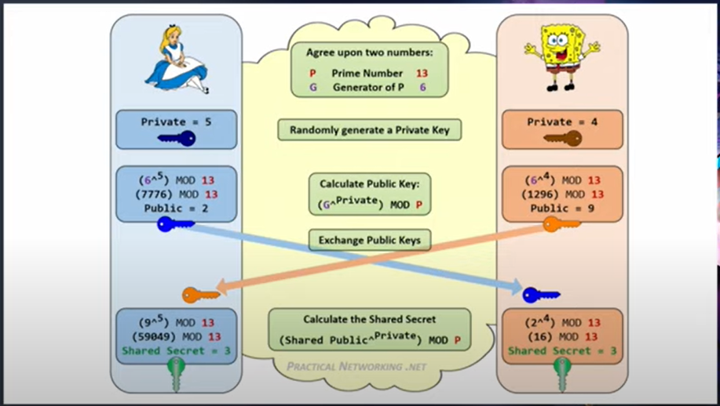
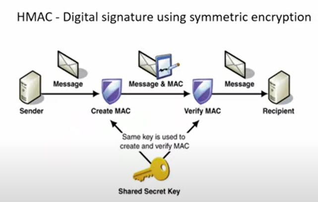

:toc:

== Java

https://www.youtube.com/watch?v=1925zmDP_BY

=== Hash

MD-5, which uses 128 bits, is hacked, someone creates several file with sam hash code.

So use Sha1 (160 bits) or Sha256 (bits).

To avoid rainbow attack, use salt.

Application: bitcoin transaction mining, find hash starting with 0000….

=== Symmetric encryption

DES (Data Encryption Standard),
block size 64 bits, key size 56 bits, is hacked, so don't use.

use AES (Advanced Encryption Standard)
- block size 128 bits
- key size 128 / 192 / 256 bits.
- encrypt by blocks, so chance repeat the encrypted message if block is repeated accidentally.
- is you use this to encrypt a Jpeg, chance that the result image is still recognizable.
 - solution is using cipher blockchain.

Application: encrypt a wallet (or zip file)

[plantuml]
----
@startuml
password --> AESKey : Password-Based key deviation function \n pbkdf2 sha256
AESKey --> encrypt
encrypt: encrypt a wallet (or zip file)
@enduml
----

[plantuml,demo,svg,opts="inline",svg-type="inline"]
----
class Demo
note right
[[class-demo.html Link to class-demo.adoc]]
end note
----
How to exchange private key,
there's a way to exchange key in a non-security channel

=== Asymmetric

public key algos:

* Diffie-Hellman key generating protocol
* RSA (Rivest-Shamir-Adleman) key size 1024 2048 3072
* ECC (Elliptic Curve Cryptography) key size 128 (used by blockchain)

*don't use Asymmetric encryption to encrypt large block of data* Because RSA is slow. But you can
- Agree on symmetric keys (Diffie-Hellman)
- encrypt/decrypt symmetric key
- encrypt hashes, or message digests(Digital signature)

=== Digital signature

*used to solve the problem is confidentially…*, not integrity.

=== java string
[source,shell]
----
jcmd <pid>
# can be used to get system properties
# so system.properties is lower safe

cat /proc/${pid}/environ
# can be used to get environment variable,
# so it's not safe either;
# better thing is, the /proc/${pid}/environ is only readable to user, not group and all
----
