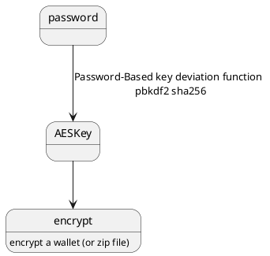
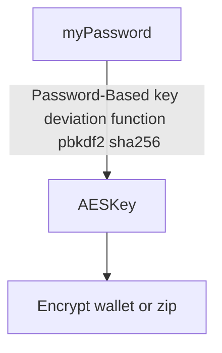
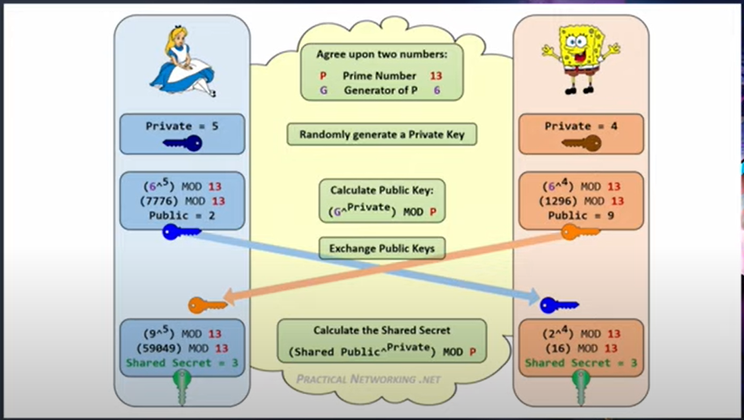
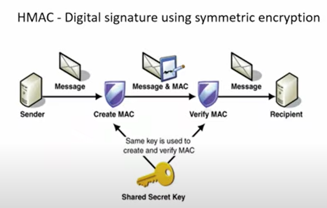

<!-- TOC -->
  * [Java](#java)
    * [Hash](#hash)
    * [Symmetric encryption](#symmetric-encryption)
    * [Asymmetric](#asymmetric-)
<!-- TOC -->

## Java

https://www.youtube.com/watch?v=1925zmDP_BY

### Hash

MD-5, which uses 128 bits, is hacked, someone creates several file with sam hash code.

So use Sha1 (160 bits) or Sha256 (bits).

To avoid rainbow attack, use salt.

Application: bitcoin transaction mining,  find hash starting with 0000....

### Symmetric encryption

DES (Data Encryption Standard),
block size 64 bits, key size 56 bits, is hacked, so don't use.

use AES (Advanced Encryption Standard)
- block size 128 bits
- key size 128 / 192 / 256 bits.
- encrypt by blocks, so chance repeat the encrypted message if block is repeated accidentally.
- is you use this to encrypt a Jpeg, chance that the result image is still recognizable.
  - solution is using cipher block chain.

Application: encrypt a wallet (or zip file)

How to exchange private key, 
there's a way to exchange key in a non-security channel

### Asymmetric 

public key algos:

- Diffie-Hellman key generating protocol
- RSA (Rivest-Shamir-Adleman) key size 1024 2048 3072
- ECC (Elliptic Curve Cryptography) key size 128   (used by blockchain)

**don't use Asymmetric encryption to encrypt large block of data** Because RSA is slow. But you can
- Agree on symmetric keys (Diffie-Hellman)
- encrypt/decrypt symmetric key
- encrypt hashes, or message digests(Digital signature)

### Digital signature

**used to solve the problem is confidentially...**,  not integrity.

