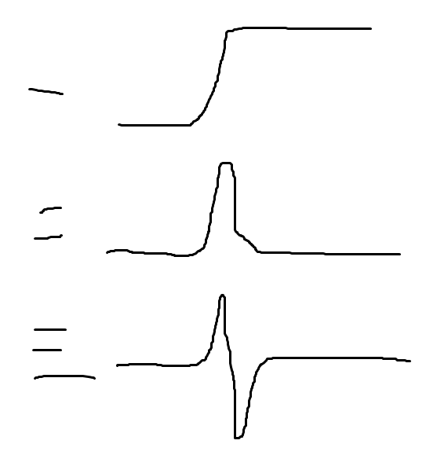

https://www.youtube.com/watch?v=NPcMS49V5hg[Lecture 05 - Scale-invariant Feature Transform (SIFT)]

https://www.youtube.com/watch?v=Q7aGsfUxXL4[Image Filtering, Convolution, Edge Detection - Dr. Mubarak Shah]

https://www.youtube.com/watch?v=uNP6ZwQ3r6A[Edge Detection Using Laplacian | Edge Detection]

https://www.youtube.com/watch?v=ram-jbLJjFg[SIFT Detector | SIFT Detector]

https://www.youtube.com/watch?v=ram-jbLJjFg&list=RDCMUCf0WB91t8Ky6AuYcQV0CcLw&start_radio=1&rv=ram-jbLJjFg&t=513[SIFT Detector | SIFT Detector all in one]

https://stackoverflow.com/questions/5234517/implementing-sift-in-java

difference of Gaussian ~= scaled normalized Laplacian of Gaussian

Gaussian blur,
[plantuml]
----
@startuml
:<math>s^ksigma</math>;
note right
the bigger k is , the more blurred output is
end note
@enduml
----

图像的2阶导数，突然从>0 变到 <0 就是一个 zero crossing, zero crossing 就是这个图像的edge.

=== Laplacian as Edge Detector

Sum of Pure Second Derivatives

[plantuml]
----
@startuml
:<math>nabla^2I = (del^2I)/(del x^2) + (del^2I)/(del y^2) </math>;
@enduml
----
Pronounced as "Del Square I"

Problem is , edges will also happen to different degrees like 45 degree,
but notmally the Del Square only count the 0 and 90.

Laplacian of Gaussian image of the function looks like a Mexican hat.

http://asciimath.org/

https://www.v7labs.com/blog/image-recognition-guide

https://www.v7labs.com/blog/convolutional-neural-networks-guide

https://www.youtube.com/watch?v=mah8PV6ugNY

https://github.com/semantic-release/semantic-release/blob/master/docs/extending/plugins-list.md