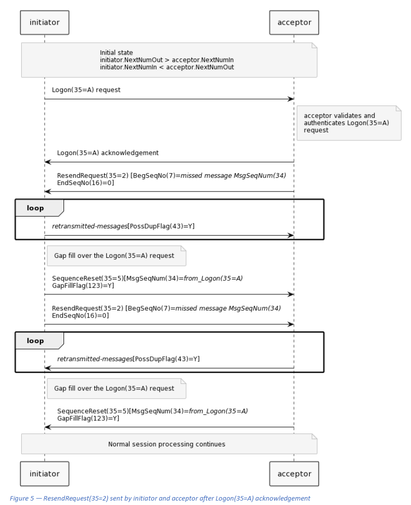

# 3 Terms and definitions

## 3.1 General terms and definitions

### 3.1.1 session layer message

A message carried over the FIX session that is integral to the operation of the FIX session.

### 3.1.2 application message

A message that is carried over a FIX session to accomplish some business purpose, such as an order to buy or sell a
financial instrument, reporting market data, reporting an execution of a trade.

### 3.1.3 message type

An identifier (code) that defines the type of message being sent. The message type for the FIX session is a case
sensitive string encoded in the MsgType(35) field.

### 3.1.4 valid FIX message

A session or application message that is a tagvalue encoded string of octets that is properly formed according to the
FIX tagvalue encoding specification.

### 3.1.5 FIX session processor

A combination of computer hardware, firmware, and software that implements the FIX session layer. Commonly
referred to as a FIX Engine.

### 3.1.6 initiator

The FIX session processor that establishes the transport layer connection and initiates the session via transmission of
the initial Logon(35=A) message.

### 3.1.7 acceptor

The FIX session processor that is able to establish a transport layer connection and receive Logon(35=A) requests from
FIX session initiators to start or resume a FIX session.

### 3.1.8 rules of engagement

A specification, usually provided in document form, that describes a specific use of FIX. Often referred to as a FIX
service offering. FIX Orchestra is a standard that may be used to specify a machine readable rules of engagement.

### 3.1.9 peer

A peer is one of the FIX session processors being communicated with over a FIX session. The peer of the initiator is the
acceptor. The peer of the acceptor is the initiator. The initiator and acceptor are peers.

### 3.1.10 counterparty

The firms or legal entities or individuals agreeing to use the FIX session layer to conduct some form of business
endeavor.

### 3.1.11 NextNumIn

Each FIX session processor must keep track of the next message sequence number it is expecting to receive from its
peer to guarantee ordered delivery of messages over the life of a FIX session that may span multiple FIX connections.
The next expected incoming sequence number (NextNumIn) is compared to the value in the MsgSeqNum(34) field in
each message received from the peer.

### 3.1.12 NextNumOut

Each FIX session processor must keep track of the next outbound sequence number (NextNumOut) it will send to its
peer over a FIX connection.

### 3.1.13 retransmission

To retransmit a message that was previously sent in order to resynchronize the FIX session. A retransmitted message
uses the original MsgSeqNum(34) value with PossDupFlag(43)=Y.

### 3.1.14 resend

The process of an application layer resending an application message because it has not received an application layer
acknowledgement for the message. A resend may only be initiated by the application layer, not the session layer. The
determination if the message was previously received is the responsibility of the application layer, not the session
layer.

### 3.1.15 gap fill

The process to resolve gaps in message sequence numbers within a FIX session.

### 3.1.16 application version

The FIX session layer provides fields to communicate versions of the application layer messages. The FIX Trading
Community defines standard application versions.

### 3.1.17 extension pack

An extension pack is an approved addition to the FIX standard. The granularity of an extension pack may vary widely
from a single enumeration value addition to the definition of entire new categories of messages. Extension packs are
identified by a sequential integer number and must be applied in order. An Extension pack is considered available for
use if it has been approved and published by the FIX Global Technical Committee. Extension packs are created on an
as needed basis and are generally driven by community requests. An extension pack is cumulative, in that the
artefacts (Orchestra file, FIXimate) include all previous extension packs. When an extension pack is published, it
becomes the FIX Latest version of FIX.

### 3.1.18 session profile

Session profiles are extensions or restrictions on the use of the standard session layer messages that can be used to
represent context of usage. FIX4, FIXT, and LFIXT are the current FIX session profiles.

### 3.1.19 CompID

An alphanumeric identifier for the entity associated with a FIX session. As this is likely a financial markets participant
company, the name was viewed colloquially as a company identifier abbreviated as a CompID.

### 3.1.20 SubID

A subidentifier optionally available to identify a subentity within a CompID. The SubID may be used to identify a
specific trader or a subunit of a business entity. The use of SubIDs is at the discretion of the counterparties. Certain
regulatory regimes globally require the use of SubID to identify specific traders.

### 3.1.21 LocationID

A location identifier providing additional location information either geographical or within a trading desk on a trading
floor. The use of LocationIDs is at the discretion of the counterparties.

### 3.1.22 transport layer connection

A FIX session relies on a transport layer to provide for ordered delivery of messages and message recovery during the
life of the transport layer connection. The FIX session does not require a specific transport layer, although TCP/IP is
widely used and is a de facto standard transport layer for FIX sessions. TCP/IP provides an ordered reliable delivery of
FIX TECHNICAL STANDARD November 2020
© Copyright, 2011-2020, FIX Protocol, Limited Page 11 of 82
a stream of bytes during the life of the TCP connection. The FIX session processor reads this stream identifying FIX
message boundaries.

### 3.1.23 in-band communication

Transmitting control information or metadata about the application layer or session layer in application and session
FIX message types over the FIX session. Sending the HeartBtInt(108) field in the Logon(35=A) message is an example of
in-band transmission of control information. Providing version information about a FIX service in the
CstmApplVerID(1129) on the Logon(35=A) message is another example.

### 3.1.24 out-of-band communication

Exchanging control information or metadata about a FIX session via a separate communication mechanism than the
FIX session. Providing the TestRequestThreshold in a rules of engagement document is an example of exchanging
information out-of-band. Providing version information about a FIX service on a website or in a rules of engagement
document is another example of out-of-band communication. Providing access to a specification online via a website
or web service would be another example of out-of-band communication. Even though this is electronic
communication, it is not being done over the FIX session to which that information applies.

### 3.1.25 TestRequestThreshold

The amount of time expressed as a multiplier of the heart beat interval before a TestRequest(35=1) message is sent to
the peer when the heartbeat interval has been exceeded without receiving a message from the peer. This value may
be specified out-of-band in a rules of engagement.

### 3.1.26 SendingTimeThreshold

The amount of time expressed in seconds in which the SendingTime(52) value in an inbound message differs from the
system time available to the receiving FIX session processor. This value may be specified out-of-band in a rules of
engagement.

### 3.1.27 LogoutAckThreshold

The amount of time expressed in seconds that a FIX session processor that has transmitted a Logout(35=5) request
will wait for the Logout(35=5) acknowledgement before terminating the transport layer connection. This value may be
specified out-of-band in a rules of engagement.

# FIX Session

## 4.2 Identifying the FIX session

A FIX session is identified by the unique combination of BeginString(8) + initiator CompID + acceptor CompID.

### 4.2.1 The FIX session profile

BeginString(8) shall be used to identify the FIX session profile or version of FIX.
These FIX session profiles are defined within this specification.

| **FIX session profile** | **BeginString(8)** | **Description**                                                                                                                                                                         |
|-------------------------|--------------------|-----------------------------------------------------------------------------------------------------------------------------------------------------------------------------------------|
| FIX.4.2                 | FIX.4.2            | The FIX session profile for use with the FIX.4.2 application layer.                                                                                                                     | 
| FIX4                    | FIX.4.4            | The FIX session profile backward compatible with FIX.4.4 recommended when counterparties will only be using a single application version during the FIX session, such as FIX Latest.    |
| FIXT                    | FIXT.1.1           | The FIX session profile that must be used when mixing multiple application versions over the same FIX session. May be used with a single application version of FIX such as FIX Latest. |
| LFIXT                   | FIXT.1.1           | Lightweight FIXT restricted session layer message recovery2 to simplify the protocol while maintaining compatibility with FIXT when using LFIXT compatible model of operation.          |

### 4.2.2 Identification of FIX session peers

FIX relies on alphanumeric strings known as CompIDs to identify the initiator and the acceptor of FIX messages.

Counterparties must agree to their respective CompID values, which act as an identifier for the peer

## 4.3 Establishing a FIX connection

Establishing a FIX connection involves three distinct operations: creation of a transport layer connection, acceptance
with optional authentication of the initiator by the acceptor and message synchronization (initialization).

The initiator shall establish a transport layer connection with the acceptor to establish a FIX connection.

### 4.3.1 Transport layer requirements

FIX session layer requires that the transport layer provides ordered and lossless message delivery and full duplex
operation for the life of the transport layer connection.

FIX implementations that use the TCP/IP protocol as the transport layer must use the FIX-over-TLS (FIXS) specification
which specifies the use of Transport Layer Security (TLS) with the FIX session layer to provide transport layer
encryption.

The initiator shall send a Logon(35=A) request message to initiate a FIX connection.

The Logon(35=A) request message must always be the first message transmitted over a FIX connection. If the acceptor
receives anything other than a valid Logon(35=A) request message, an error should be logged and the transport layer
connection terminated without Logout(35=5) processing

### 4.3.2 Using the TestMessageIndicator(464) to explicitly identify testing

Counterparties should populate the TestMessageIndicator(464) field with “Y” in the Logon(35=A) request and
acknowledgement when testing.

FIX counterparties should validate that the TestMessageIndicator(464) field corresponds to the environment.

If the TestMessageIndicator(464) with value “Y” is present in a Logon(35=A) message indicating a test session and the
environment **is not a test environment**, the peer should transmit a Logout(35=5) message with the Text(58) indicating
that the TestMessageIndicator(464) was set to “Y” and the environment is a production environment. Certain venues
support sending test messages within the production environment. Counterparties should communicate how testing
is conducted within the production environment to prevent test messages from being accepted as production
messages.

If the TestMessageIndicator(464) with value “N” is present in a Logon(35=A) message indicating a production session
and the environment **is a test environment**, the peer should transmit a Logout(35=5) message with the Text(58)
indicating that the TestMessageIndicator(464) was set to “N” and the environment is a test environment.

Failure to validate the TestMessageIndicator(464) against the environment may potentially lead to financial losses.

### 4.3.3 Application layer encryption

The use of application layer message encryption **has been discouraged since the FIX.4.3 version** of the FIX protocol.
EncyptionMethod(98) must be present in the Logon(35=A) message and set to “0” when application layer encryption
is not in use.

Firms may implement application layer encryption by counterparty agreement.

### 4.3.4 Heartbeat interval

The HeartBtInt(108) field must be present and specify the interval in seconds for generating heartbeat messages
during periods of inactivity.

The HeartBtInt(108) field must be present in the Logon(35=A) message.

The HeartBtInt(108) value must be agreed upon by the initiator and the acceptor.

The initiator and acceptor must use the same HeartBtInt(108) value within a FIX connection.

The HeartBtInt(108) value is the maximum time allowed between receipt of messages from the peer.

Each FIX session processor should implement a heartbeat interval timer. The timer should be reset upon receipt of
each message from the peer.

### 4.3.5 Heartbeat interval determination

The acceptor should convey the rules placed on the expected heartbeat interval via out-of-band rules of engagement
when such rules are required by the acceptor.

There are three methods for determining the heartbeat interval:

1. Acceptor requires a specific heartbeat interval
2. Acceptor requires initiator to specify a value within a heartbeat interval range
3. Acceptor accepts the initiator specified heartbeat interval

#### 4.3.5.1 Acceptor requires a specific heartbeat interval

The acceptor may refuse to establish a FIX connection if the HeartBtInt(108) value received on the Logon(35=A)
message sent by the initiator does not match the heartbeat interval required by the acceptor.

The acceptor must terminate the FIX session using a Logout(35=5) message when the acceptor refuses to establish a
FIX connection due to the inbound HeartBtInt(108) value not matching the expected value.

The acceptor should provide the reason for terminating the FIX connection in the Text(58) field of the Logout(35=5)
message by setting it to “Invalid HeartBtInt(108), expected value N seconds”, where N is the number of seconds
expected in the HeartBtInt(108) field on the initiator Logon(35=A) message. N shall be larger than zero.

#### 4.3.5.2 Acceptor requires initiator specify a value within a heartbeat interval range

The acceptor may refuse to establish a FIX connection if the HeartBtInt(108) value received on the Logon(35=A)
message sent by the initiator does not fall within a heartbeat interval range required by the acceptor.

The acceptor must terminate the FIX connection using a Logout(35=5) message when the acceptor refuses to establish
a FIX session due to the inbound HeartBtInt(108) value not falling within the required heartbeat interval range.

The acceptor should specify the reason for terminating the connection in the Text(58) field of the Logout(35=5)
message by setting it to “Invalid HeartBtInt(108), expected value between N and M seconds”, where N and M are the
start and end values of the range of the heartbeat interval in seconds permitted by the acceptor. N shall be larger than
zero and M shall be larger than N.

#### 4.3.5.3 Acceptor accepts the initiator specified heartbeat interval

The acceptor may accept the heartbeat interval specified by the initiator in the HeartBtInt(108) field of the initiator
Logon(35=A) message by echoing back the heartbeat interval of the initiator in the Logon(35=0) acknowledgement.

### 4.3.10 Responding to a request to establish a FIX session

### 4.3.11 Initial synchronization of messages in a FIX connection

The acceptor shall compare MsgSeqNum(34) in the Logon(35=A) request received from the initiator with NextNumIn
maintained by the acceptor.

The initiator shall compare MsgSeqNum(34) in the Logon(35=A) acknowledgement received from the acceptor with
NextNumIn maintained by the initiator.

If MsgSeqNum(34) is present in the incoming Logon(35=A) message and equal to NextNumIn, then normal processing
may commence over the FIX connection.

If MsgSeqNum(34) is present in the incoming Logon(35=A) message and greater than NextNumIn, then message
recovery must be performed.

If MsgSeqNum(34) is present in the incoming Logon(35=A) message and is less than NextNumIn, then a Logout(35=5)
message should be sent assuming that an error exists in the state of either the initiator or acceptor FIX session
processor, followed by a termination of the transport layer connection.

The initiator and acceptor should wait a short period of time following receipt of the Logon(35=A) message from the
counterparty before transmitting queued or new application messages to permit both sides to synchronize the FIX
session.

Alternatively, the initiator and acceptor may send a TestRequest(35=1) message and wait for the HeartBeat(35=0)
message sent in response to the TestRequest(35=1) message, before sending queued or new messages, as this
practice forces both sides to perform message synchronization.

### 4.3.12 Synchronization after successful logon

The following sequence diagrams show three scenarios.

1. acceptor requires retransmission of messages from initiator
2. initiator requires retransmission of messages from acceptor
3. both acceptor and initiator require retransmission of messages

--------

--------

--------

## 4.4 Extended features for FIX session and FIX connection initiation

### 4.4.1 Using NextExpectedMsgSeqNum(789) to synchronize a FIX session

The FIX session processors may use the NextExpectedMsgSeqNum(789) field in the Logon(35=A) message to
synchronize a FIX session by counterparty agreement defined in the FIX session rules of engagement6.

The time required to resume a FIX session over a new FIX connection can be reduced by alerting the peer to the next
message that is expected using NextExpectedMsgSeqNum(789) in the Logon(35=A) message. Any missing messages
can be retransmitted by the peer without requiring to use ResendRequest(35=2) messages.

A FIX session may implement next expected sequence number processing to reduce the amount of message
retransmission needed to re-establish a FIX session by counterparty agreement specified in the rules of engagement.

Each FIX session processor may populate the NextExpectedMsgSeqNum(789) with the next message sequence
number expected from its peer on the Logon(35=A) when establishing a FIX connection.

Peers should not generate a ResendRequest(35=2) message based on MsgSeqNum(34) of the incoming Logon(35=A)
message but should expect any gaps to be filled automatically via the following process

The receiving FIX session processor receiving a Logon(35=A) message with NextExpectedMsgSeqNum(789) present
shall compare the value of NextExpectedMsgSeqNum(789) with NextNumOut.

- If the received NextExpectedMsgSeqNum(789) is equal to NextNumOut, proceed sending new messages
  beginning with that number.
- If the received NextExpectedMsgSeqNum(789) is less than NextNumOut, perform message recovery for
  messages starting with the message with MsgSeqNum(34) equal to the NextExpectedMsgSeqNum(789)
  through to the message with MsgSeqNum(34) equal to NextNumOut - 1.
- If the received NextExpectedMsgSeqNum(789) is greater than NextNumOut, send a Logout(35=5) message
  to end the session with the Text(58) field populated explaining that “NextExpectedMsgSeqNum(789) >
  than last message sent”.

### 4.4.2 Using ResetSeqNumFlag(141) to reset FIX session for 24 hour connectivity

The FIX session may be reset to NextNumIn=1 and NextNumOut=1 over an active FIX session. This capability is
provided for continuously operating markets that need to periodically reset the FIX session. When using the
ResetSeqNumFlag(141) to maintain 24 hour connectivity and establish a new set of sequence numbers, the process
should be as follows.

Counterparties must agree to the time of day when the FIX session reset will be initiated.

Counterparties must agree which peer will initiate the FIX session reset.

The peer that initiates the FIX session reset may send a TestRequest(35=1) message and wait for the HeartBeat(35=0)
response to ensure that there are no message gaps prior to sending a Logon(35=A) message to reset the FIX session.

The peer initiating the FIX session reset should set its NextNumIn to 1 and NextNumOut to 1, then send a Logon(35=A)
message with ResetSeqNumFlag(141) set to “Y” and MsgSeqNum(34) set to 1.

The peer receiving the Logon(35=A) message should set its NextNumIn to 2 and NextNumOut to 1, then send a
Logon(35=A) acknowledgement with ResetSeqNumFlag(141) set to “Y” and with MsgSeqNum(24) set of 1.

Upon completion of the session reset, both peers must have NextNumIn = 2 and NextNumOut = 2.

If the peer is not configured to accept resetting of an inbound session the peer should send a Logout(35=5) with
Text(58) indicating that resetting the sequence number is not supported and then terminate the transport layer
connection.

### 4.4.3 Using ResetSeqNumFlag(141) to reset FIX session during FIX connection establishment7

The initiator of a FIX session may reset the FIX session upon initial logon via sending the Logon(35=A) with
ResetSeqNumFlag(141) set to “Y”.

Counterparties must agree to support the reset of a FIX session during FIX connection establishment.

Operational risks, such as order overfills, could occur if both parties are not configured to support resetting the FIX
session upon initial logon. Users of the FIX session layer are warned to take special care when permitting the FIX
sessions to be reset upon FIX connection establishment.

If the acceptor is not configured to accept resetting of a FIX session during FIX connection establishment, the acceptor
should send a Logout(35=5) with Text(58) indicating that resetting the sequence number upon FIX connection
establishment is not supported then terminate the transport layer connection.

### 4.4.4 Using initiator state to restore acceptor session state8
An acceptor may re-establish its state via the exchange of NextExpectedMsgSeqNum(789).

This should only be used for FIX service offerings where application message recovery is performed by the application
layer instead of the FIX session layer.

The state of the FIX session is assumed to be:
- the acceptor FIX session processor NextNumOut is unknown and NextNumIn is unknown.
- the initiator FIX session processor has maintained and knows its state (the values of NextNumIn and
NextNumOut) between FIX connections.

Acceptor state may be recovered when NextExpectedMsgSqNum(789) is present in the Logon(35=A) request by:
- The acceptor may reconstruct its session state solely based upon the Logon(35=A) request from an
initiator if NextExpectedMsgSeqNum(789) is present in the Logon(35=A) request.
- The acceptor should set its NextNumIn to the MsgSeqNum(34) + 1 from the Logon(35=A) request and set
its NextNumOut to the NextExpectedMsgSeqNum(789) from the Logon(35=A) request.
- The acceptor should then send a SequenceReset(35=4) message with GapFillFlag(123) set to “Y” and NewSeqNo(36) set to 
NextNumOut+1 and AppLevelIndicator(1744) set to “1” (application layer recovery is needed) to inform the initiator 
that application messages will need to be recovered.

Acceptor state may be recovered when NextExpectedMsgSeqNum(789) is not present in the Logon(35=A) request by:
- The acceptor may reconstruct its session state based upon the Logon(35=A) request from an initiator by
setting its NextNumIn to the MsgSeqNum(34) + 1 from the Logon(35=A) request and setting its
NextNumOut to 1 when the NextExpectedMsgSeqNum(789) is not present in the Logon(35=A) request.
- The initiator should respond to the Logon(35=A) acknowledgement with a Logout(35=5) with
SessionStatus(1409) set to 9 (received MsgSeqNum(34) is too low) and NextExpectedMsgSeqNum(789) set
to the initiator’s NextNumIn, followed by terminating the transport layer connection.
- The acceptor should set its NextNumOut to the NextExpectedSeqNum(789) value from the Logout(35=5)
received from the initiator.
- The initiator should then transmit a new Logon(35=A) request with MsgSeqNum(34) set to its NextNumOut
value.
- The acceptor should respond with Logon(35=A) acknowledgement with the MsgSeqNum(34) set to the
NextNumOut value obtained from the previous initiator Logout(35=5).
- The acceptor should then send a SequenceReset(35=4) message with GapFillFlag(123) set to “Y” and
NewSeqNo(36) set to NextNumOut+1 and AppLevelIndicator(1744) set to “1” (application layer recovery is
needed) to inform the initiator that application messages may need to be recovered.

## 4.6 FIX connection termination

Either the initiator or the acceptor may send a Logout(35=5) message to request termination of a FIX connection.
Normal termination of the message exchange session shall be completed via the exchange of Logout(35=5) messages.
Termination by other means should be considered an abnormal condition and dealt with as an error. FIX connection
termination without receiving a Logout(35=5) message should treat the peer as logged out.

A FIX session processor may send a TestRequest(35=1) message before sending the Logout(35=5) message to force a
heartbeat from the other side. This helps to ensure that there are no sequence number gaps, which indicate that a
ResendRequest(35=2) message is necessary before completing the session.
The Logout(35=5) initiator must wait for the peer to respond with a Logout(35=5) acknowledgement message before
terminating the FIX connection. This gives the peer a chance to perform any gap fill operations that may be necessary.
Once the messages from the ResendRequest(35=2) message have been received, the peer should issue the
Logout(35=5) message.

The Logout(35=5) initiator should terminate the FIX connection if the peer does not respond within a reasonable time
frame. Twice the value specified in the HeartBtInt(108) field of the Logon(35=A) message is recommended.

## 4.8 Message recovery

A message gap occurs when the MsgSeqNum(34) of an incoming message is greater than the NextNumIn maintained
by the FIX session processor.

During initialization of a FIX connection or at any time during the FIX connection, a message gap may occur.

When the MsgSeqNum(34) on an inbound message is greater than NextNumIn, the FIX session processor must
perform message recovery processing as this is an indication that there were messages sent by the peer that were not
received or may have been garbled during transmission.

### 4.8.1 Ordered message processing

The FIX protocol assumes complete ordered delivery of messages processed in MsgSeqNum(34) order.

FIX session processors must detect gaps in the sequence of MsgSeqNum(34) values by maintaining the next expected
sequence number NextNumIn.

If the MsgSeqNum(34) of an incoming message is greater than NextNumIn, then the receiving FIX session processor
should request the peer to retransmit messages following the Request retransmission of messages specifications.

The FIX session should be terminated if the incoming message MsgSeqNum(34) is less than NextNumIn and
PossDupFlag(43) is not set to “Y”, except if the message is the SequenceReset(35=4) with the GapFillFlag(123) set to
“N” (Sequence Reset). A Logout(35=5) message should be sent with the Text(58) field set to indicate that the value in
MsgSeqNum(34) is less than NextNumIn when PossDupFlag(43) is not set to “Y” and SessionStatus(1409) set to 9
(received MsgSeqNum(34) is too low.), followed by terminating the transport layer connection.

### 4.8.2 Request retransmission of messages

There are two alternative approaches to resolving message sequence number gaps.

The two approaches are:

- Request all messages subsequent to the last message received.

For example, if the receiver misses the second of five messages, the application could ignore messages 3
through 5 and generate a resend request for messages 2 through 5, or, preferably 2 through 0 (where 0
represents all messages after message 2).

- Request only the specific messages missed while maintaining an ordered list of all newer messages.

Using the above example, messages 3 through 5 would be saved for later processing and a
ResendRequest(35=2) message would be sent only for message 2.

The ResendRequest(35=2) message with BeginSeqNo(7) and EndSeqNo(16) present should be sent to the peer FIX
session processor to request missing messages when a gap is detected.

The ResendRequest(35=2) may be used to request retransmission of a single message, a range of messages or all
messages subsequent to a particular message.

The receiving FIX session processor must process incoming messages in MsgSeqNum(34) order.

The ResendRequest(35=2) message may be used to specify which messages require retransmission in the following
ways:

- To request a single message: Both BeginSeqNo(7) and EndSeqNo(16) are set the MsgSeqNum(34) of the missing message.
- To request a range of messages: BeginSeqNo(7) is set to the MsgSeqNum(34) of the first message of the range of missing messages and EndSeqNo(16) is set to the MsgSeqNum(34) of the last message of the range of missing messages.
- To request all messages subsequent to a particular missing message: BeginSeqNo(7) is set to the MsgSeqNum(34) of the first message of range and EndSeqNo(16) is set to 0. Zero is used to specify all messages after the message with MsgSeqNum(34)=BeginSeqNo(7)11.

### 4.8.3 Responding to a ResendRequest(35=2) message

Upon receipt of a ResendRequest(35=2) message, the resender shall respond by either initiating a normal gap fill
process or, in exceptional circumstances, by forcing a reset of the sequence number. In either case, the resender
assumes responsibility for the results of the decision to retransmit or not retransmit messages.

The peer receiving the ResendRequest(35=2) may choose not to retransmit certain application messages. For
instance, if orders or quotes require retransmission, the sender may choose not to retransmit them because too much
time has elapsed, causing the orders to become stale or no longer acceptable due to a change in market state.

The SequenceReset(35=4) message with GapFillFlag(123) set to “Y” (gap fill) must be used to skip messages that a
sender does not wish to retransmit in order to eliminate all gaps.

### 4.8.4 Possible duplicates

When a FIX session processor is unable to determine if a message was successfully received at its intended destination
or when responding to a ResendRequest(35=2) message, a possible duplicate message is generated. The message will
be a retransmission (with the same sequence number) of the application data in question with the PossDupFlag(43)
included and set to “Y”. It is the responsibility of the receiving firm to properly respond to the message with
PossDupFlag(43) set to “Y” by determining if the message was previously processed.

Any message resent in response ResendRequest(35=2) message must contain the PossDupFlag(43) field set to “Y”.

Messages lacking the PossDupFlag(43) field or with the PossDupFlag(43) field set to “N” shall be treated as an original
transmission.

The FIX session processor retransmitting a message with the PossDupFlag(43) set to “Y” must modify the following
fields:

- SendingTime(52) set to the current sending time
- OrigSendingTime(122) set to the SendingTime(52) from the original message
- Recalculate the BodyLength(9)
- Recalculate the CheckSum(10)

If the message is encrypted, SecureDataLen(90) and SecureData(91) may also require re-encryption and re-encoding.

## 4.8.5 Gap fill process

The peer responding to a ResendRequest(35=2) message shall retransmit messages requested by the peer in message
sequence number order, with the original sequence numbers and PossDupFlag(43) set to “Y”.

The resender shall not retransmit the following session layer message types:

- Logon(35=A)
- Logout(35=5)
- ResendRequest(35=2)
- HeartBeat(35=0)
- TestRequest(35=1)
- SequenceReset(35=4)
  
The responding peer shall send a SequenceReset(35=4) message with GapFillFlag(123) set to “Y” (gap fill) for each
session layer or application layer message not retransmitted.

Reject(35=3) and XMLnonFIX(35=n) are the only session messages which may be retransmitted.

The responding peer may choose, by counterparty agreement, not to retransmit all application messages. The
definition of which application messages are retransmitted is defined in the application layer.

A continuous sequence of messages not being retransmitted should be skipped over using a single
SequenceReset(35=4) message with GapFillFlag(123) set to “Y” and MsgSeqNum(34) set to the sequence number of
the first skipped message and NewSeqNo(36) set to the next sequence number after the sequence number of the last
message to be skipped (or “gap filled over”).

NewSeqNo(36) must always be set to the value of the next sequence number to be expected by the peer immediately
following the messages being skipped.

The SequenceReset(35=4) message with GapFillFlag(123) set to “Y” (gap fill) may also be used to skip application
messages that the sender chooses not to retransmit (for example, aged orders).

#### 4.8.5.1 Example using SequenceReset(35=4) to gap fill over multiple messages

The following example is provided to show how SequenceReset(35=4) should be used to gap fill over messages in
response to a ResendRequest(35=2).

In this example a ResendRequest(35=2) is received with BeginSeqNo(7) set to 5 and EndSeqNo(16) set to 0 (meaning
all subsequent messages following 5). Messages with MsgSeqNum(34) equal to 8, 10, 11 are application messages.

Messages 5-7 and 9 are session layer messages. Only messages 8, 10, and 11 should be retransmitted.

### 4.8.6 Sequence reset

A FIX session processor may send a SequenceReset(35=4) message with GapFillFlag(123) set to “N” (Reset) and
PossDupFlag(43) set to “Y” to force sequence number synchronization in the peer.

The firm sending the SequenceReset(35=4) with GapFillFlag(123) set to “N” is responsible for the results that occur at
the application layer caused by resetting the sequence number and not retransmitting messages requested to be
resent by the peer.

### 4.8.7 Processing inbound possible duplicate messages (PossDup(43) set to “Y”)

All FIX implementations must monitor incoming messages to detect inadvertently retransmitted session layer
messages (PossDupFlag(43) set to “Y”, indicating a retransmission).

A FIX session processor, upon receipt of an inadvertently (or improperly) retransmitted session layer message as
identified by the PossDupFlag(43) set to “Y”, should perform sequence number processing (increment NextNumIn)
only and avoid processing the session layer message.

A message received with the PossDupFlag(43) set to “Y” should be ignored when a message with the same
MsgSeqNum(34) was previously processed

### 4.8.8 Processing gaps when receiving FIX session layer messages

Gaps detected in message sequence numbers must be processed differently for certain FIX session layer messages.
The table below lists the actions to be taken when the incoming FIX session layer message has a MsgSeqNum(34) that
is greater than NextNumIn.

| Message type received                         | Action to be taken on sequence number mismatch MsgSeqNum(34) > NextNumIn                                                                                                                                                                                                                                                                                                                                                                                                                                                                                                                                                                                              |
|-----------------------------------------------|-----------------------------------------------------------------------------------------------------------------------------------------------------------------------------------------------------------------------------------------------------------------------------------------------------------------------------------------------------------------------------------------------------------------------------------------------------------------------------------------------------------------------------------------------------------------------------------------------------------------------------------------------------------------------|
| Logon(35=A)                                   | Must always be the first message transmitted. Authenticate and accept the connection. After sending a Logon(35=A) acknowledgement, send a ResendRequest(35=2) message.                                                                                                                                                                                                                                                                                                                                                                                                                                                                                                | 
| Logout(35=5) request                          | Send ResendRequest(35=2) message requesting missing messages, receive and process retransmission of missing messages and gap fills, then send the Logout(35=5) acknowledgement message which serves as a confirmation of the Logout request. **DO NOT** terminate the session. The Logout(35=5) requestor should the terminate the transport layer connection.    The only exception to the “do not terminate the session” rule is for an invalid Logon(35=5) request. The session acceptor has the right to send a Logout(35=5) message and terminate the transport layer connection immediately. This minimizes the threat of unauthorized connection attempts. |
| ResendRequest(35=2)                           | Perform the requested retransmission then send a ResendRequest(35=2) message requesting missing messages, receive and process the retransmission of missing messages and gap fills.                                                                                                                                                                                                                                                                                                                                                                                                                                                                                   |
| SequenceReset(35=4)  (GapFillFlag(123)=N) | Reset: Ignore the incoming sequence number. The NewSeqNo(36) field of this message will contain the sequence number of the next message to be transmitted.                                                                                                                                                                                                                                                                                                                                                                                                                                                                                                            |
| SequenceReset(35=4)  (GapFillFlag(123)=Y) | Gap fill: Send a ResendRequest(35=2). These messages behave similarly to SequenceReset(35=4) messages with GapFillFlag(123) set to “N”. However, it is important to ensure that no messages have been inadvertently skipped over. This means that these messages must be received in sequence. An out of sequence SequenceReset(35=4) message with GapFillFlag(123) set to “Y” is an abnormal condition.                                                                                                                                                                                                                                                              |
| All other messages                            | Perform gap fill operations.                                                                                                                                                                                                                                                                                                                                                                                                                                                                                                                                                                                                                                          |

## 4.9 Resending an unacknowledged application message

The application layer is responsible for the detection and proper handling of duplicate application messages.

The FIX session layer does not initiate a resend of an application message nor does the FIX session layer detect
duplication application messages.

The application layer may resend a message if it has not received an application layer acknowledgement for that
message.

The amount of time allowed to elapse before resending the message may be specified by counterparty agreement in a
rules of engagement.

The application layer may use the PossResend(97) set to “Y” field in the StandardHeader component along with other
fields in an application message to identify duplication application messages.

The use or non-use of the PossResend(97) field when resending application messages should be documented in the
rules of engagement.

The resent application layer message shall consume the next value of NextNumOut resulting in a new
MsgSeqNum(34) for the application message.

The FIX session processor shall treat the resent message as a new message.

The FIX session processor must pass the PossResend(97) field to the application layer when it is present in an
application message.

The use of a globally unique persistent identifier that enforces idempotent behavior at the application layer may be
used as an alternative to sending a PossResend(97) field by counterparty agreement

### 4.9.1 The difference between application layer resend and session layer retransmission

The purpose of the following diagram is to visually show the difference between an application using the
PossResend(97) value of a previously unacknowledged application message and a FIX session processor retransmitting
messages that may not have been received by its peer as a response to a ResendRequest(35=2) message from that
peer.

