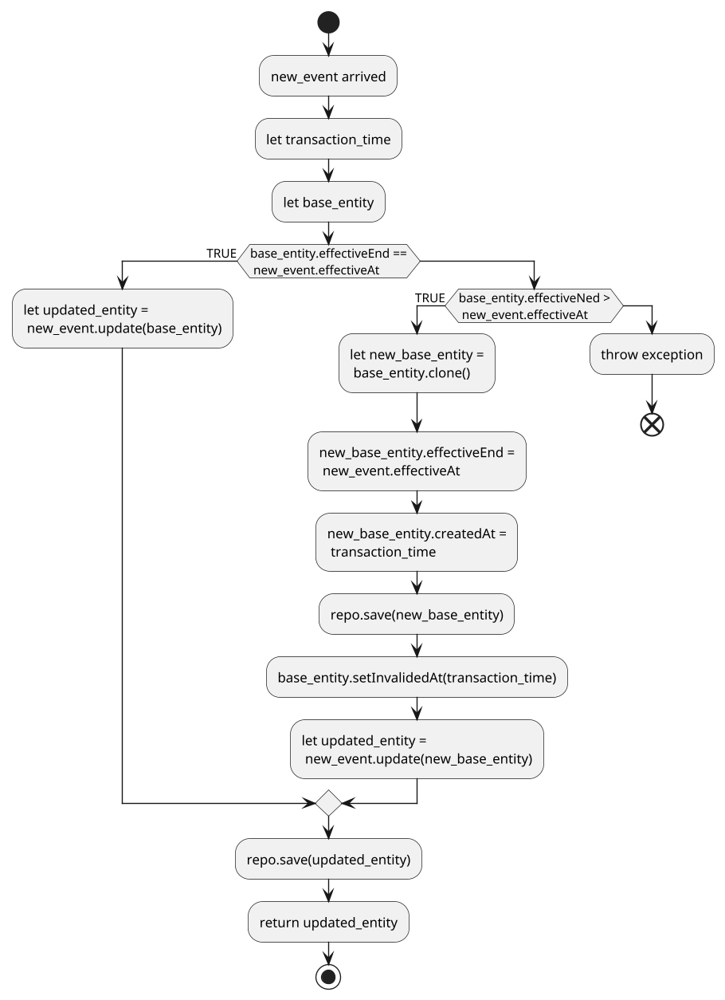
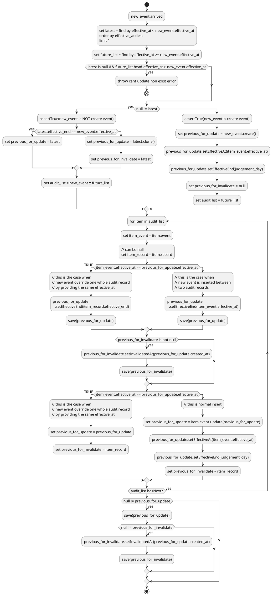
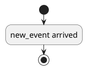

# General

This document describe a way to manage all history changes of persistable entity.

That kind of entity is called Auditable.

# Auditable

Auditable Entity should be able to reflect:

1. all historical changes.
2. when the change happens, when new change override current state.
   1. on business effect time. (logically when the change should take place.)
   2. on transaction time. (when the change is persisted. independently from business effect time)
3. triggering event. (which event cause the current change.)

## Key properties

### Auditable Entity

- auditId // the audit id
- effectAt
- effectiveEnd
- createdAt
- invalidedAt
- optimisticVersion
- eventExecutionId

### The Main Entity

- id // the id field
- auditId // the audit id
- effectAt
- effectiveEnd
- createdAt
- updatedAt
- optimisticVersion
- eventExecutionId

### Event

A Event is the trigger of Auditable state change. Auditable state can only be create/changed by Event.

- id // event id
- type // event type
- detail // a json to record all information to update the auditable's status, should make the whole history be reply-able.
- implements:  CreationEvent, UpdateEvent, DeletionEvent

### Event Source

A user or system operation (like page click, scheduler job, or another event)

- id
- sourceType (event / ui-operate / scheduler / ......)
- sourceSubType (eventType , etc...)
- triggerId // trigger person or system
- triggerType // a user ? or a system
- triggeredAt
- sourceKey (traceId for UI / or other keys)

### Event Execution

represent an event update status movement.

- id
- sourceId // event source id
- executionStatus // INITIATED, EXECUTED, FAILED
- executedAt // should be same as auditable's createdAt or invalidatedAt

# Algorithm Units

## Update Entity

# Bi-temporal

Trying to resolve below questions:

- data change need to be traceable, replaceable, reverteable.
    - when, where, who, why the data is created/updated/deleted

# Entity Audits

- In db, all time related fields should be of offset_datetime (contains the offset number), unless explicitly stated.

## Audit Record

Each Table should have its audit table with name `{origin}_audit`, in order to keep all change histories.

The audit table has below structure:

table: {origin}_audit

| field name             | field type      | length | validation | comment                                                       |
|------------------------|-----------------|--------|------------|---------------------------------------------------------------|
| audit_id               | UUID7           |        | ID         |                                                               |
| id                     | UUID7           |        | NonNull    |                                                               |
| ...origin table fields |                 |        |            | hold the new updated values                                   |
| record_status          | string          | 16     | NonNull    | CREATED/DELETED/UPDATED                                       |
| event_id               |                 |        | NonNull    | The related event                                             |
| event_type             |                 |        | NonNull    | and the event type                                            |
| update_event_id        |                 |        | Nullable   | The event that invalid or create the updated version of audit |
| update_event_type      |                 |        | Nullable   | The event that invalid or create the updated version of audit |
| created_at             | offset_datetime |        | NonNull    | create time (insert time)                                     |
| invalidated_at         | offset_datetime |        | Nullable   | time when invalidated                                         |
| effective_at           | offset_datetime |        | NonNull    | time when take effect                                         |
| effective_end          | offset_datetime |        | NonNull    | time when take effect                                         |
| optimistic_version     | int             |        | NonNull    | Optimistic locker                                             |

indexes:

- effective_at + effective_end + indexes defined in main record
- event_type + event_id
- update_event_type + update_event_id
- id
- created_at
- invalidated_at

reference:

- id : main table [id]

rules:

- all main table modification (creation, updating, deletion) need to related to an audit record.
- the audit record holds the new value of updated/created main record.
- the audit record related to a event reference by event id and event type.
- the audit record has created_at which is the insertion to DB time.
- the audit record has effective_at which means when the record apply to the main record.
  (so delay/scheduled update can be supported)
- if there's history correction, audit record CANNOT be updated in order to keep the auditable data.
    - for updates, old audit record be 'invalidated' (invalidated_at set to non-null) and new created.

### History Record

The Audit Record table is good for tracing the change history of a main record.
However, for querying the main record's status at a time point in the history will become verbose.
We have using `group by main_id` on condition `effectie_at > time_point` then query max `effective_at`.

Things can be more complicated while need complicated conditions. So it's necessary to add a column `effective_end`,
so that when given a timepoint, just append a condition `effective_at <= timepoint < effective_end` will just do the
work.

But managing the `effective_end` is also complicated while in the real business processing window.
We have to firstly get latest audit, setup it's `effective_end` from `{time_max}` to the new `effective_at`.
(Previously we just insert a new data to audit table, now we have to query-ole => update-old => insert-new. Performance
is bad.)

One way worth considering is , `effective_end` is just good for query, `non effective_end` is good for writing.
If there's no strong requirements for `strong consistency querying` of history status, we can introduce a side-way for
updating the `effective_end`, via async.

We could maintain a 3rd table in addition to main/audit , for hist status, in a async way, but it's too overhead.
Same data will be persisted in 2 places, that keeping the data consistency will introduce more complicity.

so we maintain the `effective_end` in the audit table in a async thread......

rules:

- [effective_at , effective_end) consists an interval. in that time interval, the current status is alive(effective).
- It is strictly forbidden to have overlap of [effective_at , effective_end) for same main record id.
- Intervals for same main id should be continuous, current effective_end should be identical as next's effective_at
- for DB query, the latest audit's effective_end should be a big date, like 9999-01-01, we call it `judgement_day`,
- there should be a day of `judgement_day - 1 second` for querying the latest audit, the time is called
  `before_judgement_day`

### effective_end maintenance after Inserting new Audit Record

**I. If the effective_at is strictly increasing (new state):**

1. Find the audit with `effective_at <= new_effective_at < effective_end ` for update status as the base statue
2. If first `effective_at == new_effective_at`, find audit with
   `new_effective_at ==  effective_end && effective_end != effective_at` for replay (prepend to first)
3. clone the base status' business fields.
4. update the cloned object using the event.
5. Set the found base's effective_end to new effective_at
6. Set the new one's effective_end to `judgement_day`

**II. If the effective_at is NOT strictly increasing (correct history update):**

eg: data fixing, add audit which effects from the 3rd audit from latest one.

1. Find audit with `effective_at <= new_effective_at < effective_end || effective_at > new_effective_at`, for
   new/update/replay states as the base statue
2. If the head one in found list's `effective_at == new_effective_at`, find audit with
   `new_effective_at ==  effective_end ` for replay, the prepend to first as the base statue
3. clone the base status' business fields.
4. update the cloned object using the event.
5. update `effective_end` one by next's `effective_at`
6. set the latest one's `effective_end` to `judgement_day`

This procedure is compatible with **scenario I**

**III. Needed Information for base object and updating objets**

1. AuditEntityName or AuditTableName and MainEntityName or MainTableName for querying the audit record.
2. business fields for replay
3. main record's id and effective_at for query the audit records need to be updated.
4. audit record's optimistic version for avoiding update conflict.
5. update main record's effective_end to updated (could be non `judgemant_day`)

NOTIFICATION

Better to have:

1. for code reusable, all optimistic lock columns' name should be same , like `optimistic_version`
2. for code reusable, all effective related column name , id column name, audit_id column name, should be identical.

## Events

- Each event type related to an independent table, eg `UserCreationModifyEvent` refer to `event_user_modification`, for
  aggregate similar categorized events.
- Event ID is actually mapped to a `sub event type`, eg `UserCreationPageRequest`
- Event contains requester and requester_type for referencing to the requester.
- Event has event detail for holding the creation/updating details.
- For being able to 'replay', the events MUST be incremental if it should be. Like
  `inventory stack amount increasing by` rather than `amount changed to`

### Event Detail

This is the generic event table structure with event detail.

Can have more detailed event table, which has a flatten fields of details.

Event Details is actually a json structure to holding the update detail or creation detail.

1. Event detail should contain:
    - requester
    - requester type
    - effective time : when the new state of the target object takes effect.
    - trace_id: the observability trace id, for tracing the log
    - transaction_type: for a business transaction , like `PageRequest`, or `AccountTransfer`
    - transaction_id: example: can use trace_id if `PageRequest`, or business item key for business type like
      `AccountTransfer`
2. Event detail should be persisted together in same transaction with new state of main object, it's audit, and event.
3. The audit record persisted with event detail is the 'new' state of object. so that below scenario is consistent:
    - a create-new event triggered, a new main object persisted, it's audit record with same state persisted with the
      event.
    - an update event triggered, the updated main object persisted, it's audit record with same state persisted with
      that event.
4. Event should contain all information related to the change from old state to new state, so that the state is
   traceable. Also it means the main object can be replayed from the first state to latest state using its event
   details.
5. For back tracing (revert) the state, just pop the audit record of the same main object like pop up a stack.
    - the $$ state_{t0} + event_{t1} = state_{t1} $$

Each Event Table should be:

table: audit_event_{type}

| field name             | field type      | length | validation   | comment                                                              |
|------------------------|-----------------|--------|--------------|----------------------------------------------------------------------|
| id                     | UUID7           | 64     | ID           |                                                                      |
| trace_id               | string          | 64     | FK, Nullable | for a single request like http request id                            |
| event_sub_type         | string          | 256    | NonNull      |                                                                      |
| event_sub_type_version | int             |        | NonNull      |                                                                      |
| event_detail           | json            | max    | NonNull      |                                                                      |
| requester              | string          | 64     | NonNull      | eg: {username} or {userId}                                           |
| requester_type         | string          | 128    | NonNull      | eg: UserName   or User                                               |
| processed              | bool            | 32     | NonNull      | if the event is processed, for fetch and replay the unsuccess events |
| processe_result        | string          | 32     | Nullable     | success or denied                                                    |
| processe_deny_reason   | string          | max    | Nullable     | better be a json, contains failure message and informations          |
| created_at             | offset_datetime |        | NonNull      |                                                                      |
| effective_at           | offset_datetime |        | NonNull      | time when take effect                                                |
| optimistic_version     | int             |        | NonNull      | Optimistic locker                                                    |

indexes:

- trace_id
- created_at
- effective_at
- requester_type + requester

## Main Record Table

Each Main Record Table should at least contain:

| field name         | field type      | length | validation | comment                                                        |
|--------------------|-----------------|--------|------------|----------------------------------------------------------------|
| id                 | UUID7           | 64     | ID         |                                                                |
| audit_id           | UUID7           | 64     | FK         |                                                                |
| effective_at       | offset_datetime |        | NonNull    | redundence for double check (with audit_id) Also for query |
| effective_end      | offset_datetime |        | NonNull    | redundence for double check (with audit_id) Also for query |
| created_at         | offset_datetime |        | NonNull    |                                                                |
| updated_at         | offset_datetime |        | NonNull    |                                                                |
| optimistic_version | int             |        | NonNull    | Optimistic locker                                              |

`created_at` is the insertion time, `update_at` is the last update event time. because audit is managed by audit table.
if there's delete , then delete, because the audit table records all history status.

indexes:

- created_at
- audit_id
- effective_at
- other business indexes

## Source Trigger Table

This is conceptually not the DB Transaction, it's a business transaction. But in real a business is either success or
failed.
So it normally maintained in a Db's transaction way. (but not necessary, especially some logic triggers an async step
which opens a new db transaction)

| field name          | field type      | length | validation  | comment                                             |
|---------------------|-----------------|--------|-------------|-----------------------------------------------------|
| source_trigger_type | string          | 128    | Compound ID | for a business transaction type                     |
| source_trigger_id   | string          | 64     | Compound ID | like a `trace_id` if trigger type is a http request |
| created_at          | offset_datetime |        | NonNull     |                                                     |

indexes

- trigger_type + crated_at
- created_at

### event related

| field name          | field type | length | validation  | comment                                             |
|---------------------|------------|--------|-------------|-----------------------------------------------------|
| source_trigger_type | string     | 128    | Compound ID | for a business transaction type                     |
| source_trigger_id   | string     | 64     | Compound ID | like a `trace_id` if trigger type is a http request |
| event_id            | UUID7      |        | ID          |                                                     |
| event_type          | string     | 128    | NonNull     |                                                     |

indexes

- event_id
- event_type + event_id

## logic flow

### Update

### Delete

# Aggregate Root

// To Be Done
