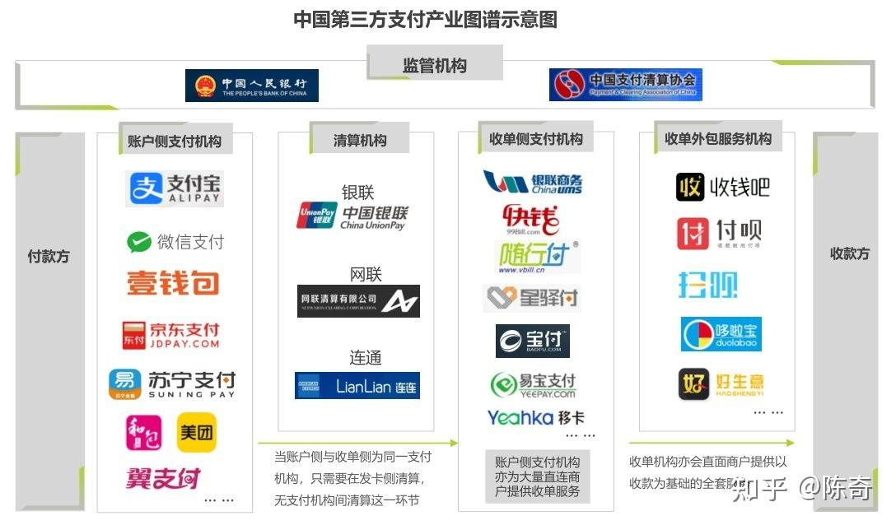

## 第一章 总 则

### 第二条 
本办法所称非金融机构支付服务，是指非金融机构在收付款人之间作为中介机构提供下列部分或全部货币资金转移服务：（一）网络支付；（二）预付卡的发行与受理；（三）银行卡收单；（四）中国人民银行确定的其他支付服务。

本办法所称网络支付，是指依托公共网络或专用网络在收付款人之间转移货币资金的行为，包括货币汇兑、互联网支付、移动电话支付、固定电话支付、数字电视支付等。

本办法所称预付卡，是指以营利为目的发行的、在发行机构之外购买商品或服务的预付价值，包括采取磁条、芯片等技术以卡片、密码等形式发行的预付卡。

本办法所称银行卡收单，是指通过销售点（POS）终端等为银行卡特约商户代收货币资金的行为。

### 第三条 
非金融机构提供支付服务，应当依据本办法规定取得《支付业务许可证》，成为支付机构。支付机构依法接受中国人民银行的监督管理。未经中国人民银行批准，任何非金融机构和个人不得从事或变相从事支付业务。

## 中国人民银行就发布条码支付规范答记者问（2017年）

问：业务规范方面有哪些主要措施？

答：一是强调业务资质要求。明确支付机构向客户提供基于条码的付款服务时，应取得网络支付业务许可；支付机构为实体特约商户和网络特约商户提供条码支付收单服务的，应当分别取得银行卡收单业务许可和网络支付业务许可。

以微信支付和支付宝为例，说一下应用场景与业务许可对应关系：

【支付应用场景】|	【要求的支付业务许可类型】 |
-------------|------------------------|
线上PC、App、公众号、小程序、H5支付 （包括用户主动支付和被动扣款） |	互联网支付
静态收款二维码（用户打开app扫码） |	互联网支付
线下的刷脸支付	| 银行卡收单
线下的条码支付（用户出示动态付款码） 	| 银行卡收单

